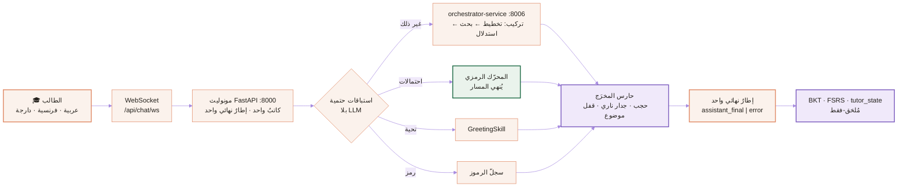

<div align="center">

<picture>
  <source media="(prefers-color-scheme: dark)" srcset="docs/assets/brand/hero-dark.svg">
  <source media="(prefers-color-scheme: light)" srcset="docs/assets/brand/hero-light.svg">
  
</picture>

<br/>

**محرّك تعلّمٍ يقيس ما يعرفه الطالب فعلاً — ويرفض أن يُسلّمه الجواب.**

المستودع `NAAS-Agentic-Core` · المحرّك **CogniForge** · المنتج **ETAALIM.AI** · مبنيٌّ لبكالوريا الجزائر، ومُهندَسٌ على المعيار الذي تُدقّق به أسواق أمريكا وأوروبا.

<br/>

[](#١--ما-هذا-النظام-فعلاً)
[](#٥--النواة-المعرفية)
[](#٦--انضباط-الحقيقة)
[](#٧--كل-قانون-يسمي-فارضه)
<br/>
[](pyproject.toml)
[](app)
[](frontend)
[](.github/workflows/ci.yml)
[](LICENSE)

[English](README.md) · **العربية**

</div>

---

> [!IMPORTANT]
> **النظام ليس معلّم دردشة. هو مختبر معرفي — محرّك تفكير يُنمذج تفكير الطالب ويختبره ويحسّنه.**
> الدردشة واجهة تسليم لا أكثر. والقلب هو: واجهة الكائنات التفاعلية · النمذجة المعرفية · ذاكرة الخطأ · التوليد التكيّفي · المحاكاة.
> — [`CLAUDE.md`](CLAUDE.md) §0، الدستور التشغيلي الذي يرثه كل مساهمٍ وكل وكيل.

---

## الفهرس

| | | |
|---|---|---|
| [١ · ما هذا النظام فعلاً](#١--ما-هذا-النظام-فعلاً) | [٧ · كل قانون يسمّي فارضه](#٧--كل-قانون-يسمي-فارضه) | [١٣ · عقد الـCI](#١٣--عقد-الـci) |
| [٢ · لماذا نحجب الجواب](#٢--لماذا-نحجب-الجواب-نتيجة-منشورة-لا-ذوق-تصميم) | [٨ · طبقات التنسيق التسع](#٨--طبقات-التنسيق-التسع) | [١٤ · الحماية وحدّ المصداقية](#١٤--الحماية-وحماية-البيانات-وحد-المصداقية) |
| [٣ · الوظائف الأربع](#٣--الوظائف-الأربع-واختبار-الحذف) | [٩ · ما لم يُبنَ عمداً](#٩--ما-لم-يبن-عمداً) | [١٥ · خريطة سلطة التوثيق](#١٥--خريطة-سلطة-التوثيق) |
| [٤ · المعمارية](#٤--المعمارية-في-لمحة) | [١٠ · البدء السريع](#١٠--البدء-السريع) | [١٦ · المساهمة](#١٦--المساهمة) |
| [٥ · النواة المعرفية](#٥--النواة-المعرفية) | [١١ · خريطة المستودع](#١١--خريطة-المستودع) | [١٧ · الرخصة والاستشهاد](#١٧--الرخصة-والاستشهاد-والتواصل) |
| [٦ · انضباط الحقيقة](#٦--انضباط-الحقيقة) | [١٢ · خارطة الطريق](#١٢--خارطة-الطريق) | |

---

## ١ · ما هذا النظام فعلاً

ثمانمئة ألف طالبٍ جزائري يجلسون لامتحان البكالوريا. المحتوى مجّانيٌّ أصلاً — Dzexams وONEFD ويوتيوب. والشرح صار مجّانياً يوم شُحنت النماذج اللغوية العامّة. **ولا واحدٌ منهما نادر، فلا واحدٌ منهما يستحقّ ثمناً.**

الذي لا وجود له في هذا السوق هو نظامٌ يعرف **ما لا يعرفه طالبٌ بعينه**، ويرتّب الساعات المتبقّية بما يُكسب نقاطاً في الامتحان فعلاً، ويرفض أن يُنتج الخطوة التي ما زال الطالب قادراً على توليدها، ويُثبت العائد للوليّ الذي يدفع.

وهذا بالضبط ما يبنيه هذا المستودع.

> **الجملة الدستورية:** «الطالب لا يرسل سؤالاً إلى النظام؛ الطالب يدخل مسار تعلّم حيّ، والنظام مسؤول عن حفظ هذا المسار من الانهيار.» — [`.memory/pedagogical_os.md`](.memory/pedagogical_os.md) (D-153)

ثلاث خصائص تجعله غير مألوف، وثلاثتها مفروضةٌ ببوّابات CI لا موعودةٌ في نثر:

1. **الأرقام لا تُولَّد أبداً.** كل احتمالٍ وعددٍ وقيمةٍ تركيبية تأتي من محرّكٍ رمزي حتمي. النموذج اللغوي يسرد الفهم، ولا يقرّر الحقيقة أبداً.
2. **الجواب محجوبٌ بقانون.** لا يكشف النظام نتيجةً ولا خطوةً يستطيع الطالب توليدها. وهذه نتيجةٌ تجريبية منشورة لا تفضيلٌ أسلوبي — انظر [§٢](#٢--لماذا-نحجب-الجواب-نتيجة-منشورة-لا-ذوق-تصميم).
3. **لا قدرةَ تُدَّعى بلا برهان.** المكوّن `ACTIVE` فقط باستيرادٍ + سلسلة نداء + دليلٍ تشغيلي. وما دون ذلك يُوسَم `PARTIAL` أو `DORMANT` أو `ZOMBIE` — علانيةً في [`.memory/runtime_truth.md`](.memory/runtime_truth.md).

---

## ٢ · لماذا نحجب الجواب: نتيجة منشورة لا ذوق تصميم

Bastani وآخرون، *PNAS* (2025) — تجربة ميدانية عشوائية على نحو ألف تلميذٍ ثانوي في الرياضيات:

<div align="center">

| الحالة | أثناء التمرين | في الامتحان بلا مساعدة |
|:---|:---:|:---:|
| وصولٌ حرّ بواجهة تشبه ChatGPT | **+٤٨٪** | **أسوأ بـ١٧٪** ممّن لم يستعمل شيئاً أصلاً |
| النموذج نفسه بضوابط تربوية (تلميحات لا إجابات) | **+١٢٧٪** | الضرر أُلغي |

</div>

مجموعة الوصول الحرّ *شعرت* بأنها أفضل بكثير، و*أدّت* أسوأ حين سُحبت الأداة. وهذه المسافة بين الطلاقة المُتوهَّمة والقدرة الراسخة اسمها هنا **فجوة الوهم**، وتقليصها هو **مقياس النجاح الوحيد** الذي نُحسّن عليه.

> **أهدافٌ ممنوعة دائماً:** مدّة الجلسة · عدد الرسائل · الرضا اللحظي. النظام الذي يُعظّم هذه الثلاثة يُعظّم الوهم نفسه.

**فجوة الوهم = الأداء المدعوم − القدرة غير المدعومة المؤجَّلة.** تُبَثّ باسم `cogniforge_tutor_illusion_gap` وتُعرَض على [لوحة Grafana رقم 180](observability/grafana/dashboards/180-illusion-gap.json). وحين لا يبلغ القياس نضجاً يسمح بالصدق — ملاحظاتٌ غير مدعومة أقلّ من الحدّ — يُرجِع `null` لا صفراً. الصفر يُقرأ «فقدناهم»، والحقيقة «لم نعرف بعد».

الحجّة كاملةً بمراجعها: [`docs/VALUE_DOCTRINE.md`](docs/VALUE_DOCTRINE.md).

---

## ٣ · الوظائف الأربع، واختبار الحذف

<picture>
  <source media="(prefers-color-scheme: dark)" srcset="docs/assets/brand/four-functions-dark.svg">
  <source media="(prefers-color-scheme: light)" srcset="docs/assets/brand/four-functions-light.svg">
  
</picture>

كل ميزةٍ مقترحة تواجه سؤالاً واحداً: *لو حُذفت، أيٌّ من الأربع يتوقّف؟* فإن كان الجواب «لا شيء، لكنها تبدو متقدّمة» — **تُحذَف**. وتسع قدراتٍ محرَّمةٌ صراحةً على هذا الأساس بعينه، منها: مكتبة محتوى · نموذج مُدرَّب من الصفر · تتبّعٌ معرفي عميق قبل بياناتٍ ضخمة · جدارية تصنيف · وأيّ آلية تصميمٍ إدماني. المستخدمون قاصرون تحت ضغط امتحانٍ مصيري، فآليات الالتزام **يختارها الطالب ويستطيع فسخها** ([`SAFEGUARDING.md`](SAFEGUARDING.md)).

---

## ٤ · المعمارية في لمحة



**المحادثة عبر WebSocket حصراً** — لا وجود لـ`POST /api/chat/messages` (يُرجع 404 عمداً). المفتاح `question`، والمصادقة عبر `subprotocols=['jwt', TOKEN]`، وكل دورٍ يُصدِر **إطاراً نهائياً واحداً** من مُصدِرٍ وحيد. رسالة الطالب يكتبها المونوليث عند مدخل الـWebSocket، وكتابة ردّ المساعد تُنسَّق بعَلَم `persisted` صريح فتستحيل الكتابة المزدوجة ([`CLAUDE.md`](CLAUDE.md) §6.5).

### طوبولوجيتان حقيقيتان — تُوثَّقان اثنتين لا واحدة

<table>
<tr><th align="right" width="50%">(أ) Codespaces / uvicorn — ما يخدم اليوم</th><th align="right" width="50%">(ب) Docker Compose — وجهة الهجرة</th></tr>
<tr valign="top"><td>

يُقلعها `.devcontainer/supervisor.sh`.

`الواجهة :5000` · `المونوليث :8000` · `user :8001`
`planning :8002` · `conversation :8003` · `orchestrator :8006`
`research :8007` · `reasoning :8008` · `content-retrieval :8009`
`foundations :8010` · `notation :8011`
`Prometheus :9090` · `Grafana :3001`

**كل دور طالبٍ اليوم يمرّ من هنا.**

</td><td>

`docker-compose.yml` يصف وجهة الـstrangler-fig: بوّابة API وقاعدة بيانات لكل خدمة، **والمونوليث غائبٌ عن قصد** (ثلاث بوّابات تمنع إعادته).

المنافذ تختلف عن (أ) لخمس خدمات. والمصدر القانوني المحكوم ببوّابة هو [`docs/architecture/PORTS_SOURCE_OF_TRUTH.json`](docs/architecture/PORTS_SOURCE_OF_TRUTH.json) و[`config/microservice_catalog.json`](config/microservice_catalog.json) — **13 خدمة مصغّرة** مُعلَنة.

**البناء ليس تشغيلاً.** الصور تُبنى ويُثبَت استيرادها في كل PR؛ ولا حاوية تطبيقية تُقلَع في CI.

</td></tr>
</table>

### حدّ الخدمة عقدٌ لا لغة

كل خدمة تحمل عقد OpenAPI مُلتزَماً، وبوّابة تكافؤٍ **دلالية** تقارن المسارات المُعلَنة بالتطبيق الحيّ — **API-first 15/15**، تفرضها `check_openapi_parity` في كل طلب دمج. والاستيراد بين الخدمات ممنوعٌ ومفحوصٌ بـAST؛ المنطق المشترك **يُوَرَّد ببوّابة تكافؤ** لا يُستورَد، فلا تمدّ خدمةٌ يدها إلى أحشاء أخرى.

---

## ٥ · النواة المعرفية

| الطبقة | ما هي | لماذا تهمّ |
|---|---|---|
| **المحرّك الرمزي للاحتمالات** | [`app/services/skills/`](app/services/skills) — تركيبات وحساب شرطي ومتغيّرات عشوائية، حتمياً | صفر LLM في مسار الأرقام. معلّمٌ يخطئ حساباً مرّةً يفقد الطالب إلى الأبد |
| **الأسس** | [`app/core/foundations/`](app/core/foundations) — منطق · نظرية أعداد · جبر خطّي · تفاضل · إحصاء · تحسين · نظرية بيان · لغات صورية · قابلية حساب · تعقيد | stdlib بلا تبعيات. كل بدائية ترفع عند خرق المجال بدل أن تُعيد `0` مضلِّلاً |
| **نواة الاستدلال** | [`app/core/reasoning/`](app/core/reasoning) — أشجار حجاج باستلزامٍ مُتحقَّق · رسوم سببية (سببية مقابل ارتباط) · تفكيك · تجريد · نماذج ذهنية | الصحّة يقرّرها المحرّك لا النموذج. النموذج يسرد |
| **BKT** | [`bkt_engine.py`](app/services/skills/bkt_engine.py) — تتبّع معرفة بايزي، سجلّ تفاعل مُلحَق-فقط | الإتقان احتماليةٌ بتاريخٍ زمني، لا درجةٌ تُكتَب فوق سابقتها |
| **جدولة FSRS-5** | [`shared/scheduling/fsrs.py`](shared/scheduling/fsrs.py) | إجابةٌ صحيحة بسقالةٍ كاملة تُقيَّم `HARD` لا `GOOD`، و`EASY` تتطلّب استقلالاً **و**رسوخاً معاً — وإلّا أتمتنا وهم الطلاقة |
| **منهاجٌ واحد** | [`shared/curriculum/registry.py`](shared/curriculum/registry.py) — **37 مفهوماً**، رياضيات وفيزياء وعلوم طبيعة، بحوافّ شروطٍ مسبقة | كانت ثلاثة تعاريف متنافرة لا يتّفق أيّ اثنين، فكانت أسئلة الفيزياء كلّها تسقط إلى `general`. رسمٌ واحد الآن، مفروضٌ ببوّابة |
| **سجلّ الرموز** | [`shared/notation/registry.py`](shared/notation/registry.py) | النظام يُعرّف كل رمزٍ يطبعه — `C(n,k)` · `P_A(B)` · `Ω`. ورمزٌ يُبَثّ بلا إدخالٍ في السجلّ ⇒ CI أحمر |
| **فجوة الوهم** | [`shared/illusion/`](shared/illusion) | دون حدّ الملاحظات تُرجِع `None`. وتقريرٌ يُلوّن المنهاج كلّه بعد جلستين **تقريرٌ كاذب** |

**مهارات لا Prompt Spaghetti.** كل قدرة ذكاءٍ اصطناعي هي Skill: مسؤولية واحدة · عقد محدَّد · مقاييس Prometheus · اختبارات قابلة للتشغيل · وتدهور رشيق مستقلّ. **39 مهارة** مُسجَّلة في [`app/services/skills/registry.py`](app/services/skills/registry.py)، كلٌّ منها يرث `BaseSkill`؛ ومهارةٌ بلا مستهلكٍ حيّ **تُحذَف** ولا تُترَك stub.

---

## ٦ · انضباط الحقيقة

<picture>
  <source media="(prefers-color-scheme: dark)" srcset="docs/assets/brand/proof-ladder-dark.svg">
  <source media="(prefers-color-scheme: light)" srcset="docs/assets/brand/proof-ladder-light.svg">
  
</picture>

جدول الحالة الحيّ هو [`.memory/runtime_truth.md`](.memory/runtime_truth.md) — **ولا يُنسَخ هنا عمداً**، لأن جدول حالةٍ منسوخاً في ملفٍّ ثانٍ ينحرف ثمّ يكذب. وبوّابة انحراف ([`scripts/runtime_truth.py`](scripts/runtime_truth.py) `--check`) تقارن الكود بقفلٍ مُلتزَم في كل طلب دمج.

ثلاث نتائج نعيش بها:

- **العملية الحيّة ليست خدمةً صحيحة.** افحص استجابة `/health` لا قائمة العمليات؛ وخدمةٌ تُقلع ويفشل تسخين رسمها **degraded**، ويقولها `startup_state`.
- **لوحةٌ تعرض صفراً دائماً لا تُميَّز عن نظامٍ ميت.** فكل مقياسٍ يلزمه مُصدِرٌ مُتحقَّق في مصدر التطبيق.
- **تقادم ملفّ القفل عطبٌ يُبلَّغ.** ملفّات القفل تسجّل تاريخ توليدها؛ وبوّابةٌ خضراء على قفلٍ بائت **خضرةٌ كاذبة**.

---

## ٧ · كل قانون يسمّي فارضه

الملاحظة المؤسِّسة لهذا الكود: **البيت لا ينهار بقرارٍ واحد سيّئ، بل بحاصل جمع قراراتٍ صغيرة لم يحرسها شيء.** فقانونٌ بلا فارضٍ آلي **مرفوضٌ مرّتين**: مرّةً لأنه غير مفروض، ومرّةً لأن صمته يُقرأ انضباطاً.

| القانون | الفارض | ما يُحمِّر الـCI |
|---|---|---|
| لا صدفة في تنفيذ العمليات الفرعية | [`check_no_shell_true.py`](scripts/fitness/check_no_shell_true.py) | أيّ `shell=True`. الدَّين المُجمَّد **فارغ** ويتقلّص فقط |
| سياسة الحجب متطابقة في العقلين اللذين يفرضانها | [`check_redaction_parity.py`](scripts/fitness/check_redaction_parity.py) | مسارٌ يحجب الجواب وآخر يسرّبه |
| علامات النيّة لها موطنٌ واحد | [`check_intent_single_source.py`](scripts/fitness/check_intent_single_source.py) | قائمةٌ ثانية لعلامات النيّة في أيّ مكان |
| قدرة النموذج بيانٌ بدليلٍ مؤرَّخ | [`check_model_registry.py`](scripts/fitness/check_model_registry.py) | نموذجٌ محظور يُرقّى، أو إدخالٌ بلا دليل |
| كل رمزٍ يطبعه المعلّم قابلٌ للتعريف | [`check_notation_definable.py`](scripts/fitness/check_notation_definable.py) | رمزٌ يُبَثّ بلا إدخالٍ في السجلّ |
| رسمٌ واحد للشروط المسبقة لا اثنان | [`check_prerequisite_single_graph.py`](scripts/fitness/check_prerequisite_single_graph.py) | مجتازٌ ثانٍ يقرأ رسماً مختلفاً |
| الحيرة لا تُهنَّأ | [`check_understanding_evidence.py`](scripts/fitness/check_understanding_evidence.py) | اعتبار **اسم** المفهوم داخل سؤال الطالب دليلاً على فهمه |
| بوّابةٌ لا تقرأ ملفاً لا تُبلِّغ أنه نظيف | [`check_gate_parse_honesty.py`](scripts/fitness/check_gate_parse_honesty.py) | `except SyntaxError: return []` — عمىً صامت داخل فارض |
| الدستور يساوي الواقع؛ الرقم يُشتَقّ ولا يُكتب | [`check_constitution_reality.py`](scripts/fitness/check_constitution_reality.py) | أيّ عددٍ مكتوبٍ يدوياً في وثيقة سلطة يخالف مصدره — **بما فيه هذا الملفّ** |
| خرائط السلطة تصل | [`check_authority_links.py`](scripts/fitness/check_authority_links.py) | رابطٌ في هذا الملفّ أو `CLAUDE.md` أو فهرس التوثيق يشير إلى مسارٍ غير موجود |
| كل مجالٍ حاسوبي يُصرِّح حالته ودليله | [`check_cs_knowledge_map.py`](scripts/fitness/check_cs_knowledge_map.py) | `ACTIVE` أمام ملفٍّ محذوف، أو خانة فجوةٍ فارغة |
| القيم البصرية من الرموز بتباينٍ **محسوب** | [`check_design_tokens.py`](scripts/fitness/check_design_tokens.py) | لونٌ خام في مكوّن، أو زوجٌ يفشل WCAG AA عند **الحساب** |

لتشغيل المجموعة كاملةً محلياً — تقرأ `ci.yml` فلا تنحرف عنها:

```bash
make gates
```

> **يُقال صراحةً:** اختبار الحذف في [§٣](#٣--الوظائف-الأربع-واختبار-الحذف) يفرضه **حكمٌ بشري في المراجعة — بلا فارضٍ آلي**. المفروض آلياً هو **تصنيف** كل وحدة وحالتها. وإعلان غياب الفارض قاعدةٌ هنا: الخانة الفارغة تُقرأ انضباطاً، أمّا الفجوة المنطوقة فلا.

---

## ٨ · طبقات التنسيق التسع

انتقلت قيمة النظام من «اكتب Prompt أفضل» إلى «صمّم المنظومة التي تُنسّق عمل الوكلاء». الـPrompt مؤقّتٌ سياقيٌّ قابل للضياع؛ والمنظومة تُنتج مخرَجاً مستقرّاً قابلاً للاختبار وإعادة الاستعمال.

```
Knowledge → Skills → Agents → Orchestration → Memory → Evaluation → Governance → Infrastructure → Humans
```

المعرفةُ ما نعرفه · والمهارةُ كيف ننفّذه · والوكيلُ من ينفّذ · **والتنسيقُ من يفعل ماذا ومتى وبأيّ سياق ومن يراجع قبل الدمج.** القانون في [`docs/architecture/AGENTIC_ORCHESTRATION_DOCTRINE.md`](docs/architecture/AGENTIC_ORCHESTRATION_DOCTRINE.md)، والحالة الحيّة في [`.memory/agentic_runtime_doctrine.md`](.memory/agentic_runtime_doctrine.md). والفصل بينهما **إلزاميٌّ ومحروس**: وثيقة القانون تفشل في CI إن نبت لها عمود حالة، وجدول الحالة يفشل إن استشهد بدليلٍ لا وجود له.

**والبشر طبقةٌ لا استثناء** (التاسعة): تبنّي تقنيةٍ جديدة يتطلّب ADR، ورفعُ أيّ مِسنَنٍ مُعلَن — سقف دَينٍ أو أرضية تغطية — يتطلّب قراراً مكتوباً يُسمّي السبب، فيصير التخفيف مكلفاً ومرئياً بدل أن يكون صامتاً.

---

## ٩ · ما لم يُبنَ عمداً

هذا القسم موجودٌ لأن نظاماً لا يُعلن إلّا مواطن قوّته لا يمكن تدقيقه.

| غير مبنيّ | الحالة | لماذا يُصرَّح به بدل أن يُخفى |
|---|---|---|
| **بوّابة دفع** | مقعد بصفر كود | الحقوق والقسائم المُجزَّأة موجودة؛ وSATIM/Chargily مقعدٌ موثَّق. لا تكامل نصفيّ يتظاهر بقبض المال |
| **نموذج لغوي موصولٌ بمُنفِّذ الصندوق** | **مقفول** | الصندوق يُشغّل أوامر حقيقية والمستخدمون قاصرون. توصيل أيّ مُخطِّط أو نموذج بالأدوات محظورٌ حتى تكتمل عقود القدرات والمسابر الحيّة والميزانيات وسجلّ تدقيقٍ مُلحَق-فقط وحُرّاس التعديل الذاتي. وبندٌ في CI يُفشِل البناء إن جمعت وحدةٌ المُنفِّذ مع عميل نموذج |
| **عامل Temporal** | الخادم مُثبَت، والعامل لم يتّصل قطّ | الخادم يُبلِّغ SERVING في CI؛ **ولم يُنفَّذ أيّ سير عمل**. الإقلاع ليس تنفيذاً، ونرفض تقريب ذلك |
| **الاسترجاع المتّجهي** | DORMANT | التضمينات وإعادة الترتيب موجودة بصفر نداء وقت الطلب. والاسترجاع اليوم حتميٌّ معجمي |
| **المونوليث في compose الافتراضي** | غائبٌ عن قصد | Strangler المرحلة 3؛ ثلاث بوّابات تمنع إعادته، وبيته ملفّ legacy |
| **تتبّع معرفي عميق (DKT/SAKT)** | محرَّمٌ الآن | حجم البيانات لا يبرّره. ومعرفةُ **لماذا** رُفض الأحدث تشتري مصداقيةً أكثر من استعماله |
| **حاويات تطبيقية في CI** | غير مُقلَعة | تُقلَع حزمة الأحداث وحدها (Redpanda وTemporal) في كل PR |

> **حدّ المصداقية (D-227) مطبَّقاً على كلامنا نحن:** لا ادّعاء «قراءة الأفكار» ولا «دقّة ١٠٠٪» ولا «صفر أخطاء» ولا «تغيير البشرية». العبارة غير القابلة للتفنيد **دَينٌ لا طموح**: تُصدَّق مرّة، ثمّ تُكتشَف، ثمّ يسقط معها كلُّ ما هو صحيح. والمنصّة تخدم قاصرين وأولياءَ يقرّرون بناءً على ما نقول.

---

## ١٠ · البدء السريع

### للمطوّرين والباحثين

```bash
git clone https://github.com/HOUSSAM16ai/NAAS-Agentic-Core.git
cd NAAS-Agentic-Core

python3.12 -m venv .venv && source .venv/bin/activate
python -m pip install --upgrade pip
pip install -r requirements-dev.txt -r requirements-test.txt

# البوّابات التي تحسم قابلية الدمج — نفس المجموعة وبنفس الترتيب كما في CI
ruff check . && ruff format --check .
make gates                       # كل بوّابات اللياقة، مقروءةً من ci.yml
pytest -v --cov=app --cov-report=term-missing --cov-fail-under=73
```

### تشغيل المنصّة

```bash
# Codespaces / devcontainer: المُشرِف يُقلع الخلفية والواجهة والخدمات
.devcontainer/supervisor.sh

# أو يدوياً
python -m uvicorn app.main:app --host 0.0.0.0 --port 8000     # الخلفية
cd frontend && npm run dev                                     # الواجهة على :5000

# الصحّة — اقرأ الاستجابة، لا قائمة العمليات
curl -s http://localhost:8000/health | python -m json.tool
```

> [!NOTE]
> التطبيق لا يُقلع بلا `DATABASE_URL` (أو `APP_DATABASE_URL`)، والإعدادات تُقرأ من **بيئة العملية** وقت الاستيراد — فالتصدير إلى البيئة قبل تشغيل uvicorn **إلزامي**، وكتابة `.env` وحدها لا تكفي. استعمل `postgresql+asyncpg://` لا `postgresql://` المجرّدة. ابدأ بنسخ [`.env.example`](.env.example).

### الحزمة الكاملة على Docker

```bash
docker compose -f docker-compose.yml up -d      # طوبولوجيا وجهة الهجرة
make microservices-health
```

---

## ١١ · خريطة المستودع

```text
.
├── app/                    مونوليث FastAPI — routers · skills · محرّكات النواة · kernel
│   ├── core/               foundations · reasoning · settings · database · prompts
│   ├── services/skills/    39 مهارة مُسجَّلة، كلٌّ على BaseSkill
│   └── api/routers/        مداخل HTTP + WebSocket (المحادثة WS حصراً)
├── shared/                 محرّكات بلا تبعيات: curriculum · scheduling · notation
│                           illusion · analytics · messaging · retrieval · ai_models
├── microservices/          جزر الخدمات — لكلٍّ عقدها وDockerfile خاصّ بها
├── frontend/               تطبيق Next.js · رموز التصميم · عقود الثيم
├── scripts/fitness/        الفوارض — بوّابة لكل قانون
├── tests/                  عقود · معمارية · حراسة · ترانسكريبت · أمن
├── docs/                   عقيدة المعمارية · ADRs · العقود · الحوكمة
│   ├── architecture/       عقيدة الهندسة · خريطة علوم الحاسوب · التنسيق
│   └── contracts/openapi/  13 عقد خدمةٍ مُلتزَماً
├── observability/          Prometheus · لوحات Grafana · توصيل التتبّع
├── infra/                  Kubernetes · Terraform · ArgoCD
├── .memory/                الذاكرة المؤسسية — الحقيقة التشغيلية · القرارات · البلاغات
└── CLAUDE.md               الدستور التشغيلي (D-001 → D-292)
```

---

## ١٢ · خارطة الطريق

المصدر الحيّ الوحيد هو [`.memory/roadmap.md`](.memory/roadmap.md) — المراحل `M0 → M11` للمحرّك التربوي، ومساراتٌ موازية لطبقة المنتج وطبقة القيمة والإيراد ومحرّك التنفيذ المعرفي والتوأم الرقمي المعرفي. وكل وحدةٍ مخطّطة تحمل حالةً من سلّم البرهان ودليلاً ملفّياً وفجوةً مكتوبة وشرط ترقيةٍ صريحاً.

**الطموح يُصنَّف ولا يُكتَم**: `PLANNED` و`SEAM` و`ABSENT` إعلانات مُتتبَّعة. والطموح غير المُصنَّف هو الذي يُنسى.

سجلّ البلاغات والقرارات: [`.memory/decisions.md`](.memory/decisions.md) (D-001 → D-292) · [`.memory/issues.md`](.memory/issues.md) (ISS-001 → ISS-202). كلاهما سجلٌّ مُلحَق-فقط يشمل الإخفاقات — وبلاغُ كارثةٍ بلا جذرٍ مكتوب ليس مُغلَقًا.

---

## ١٣ · عقد الـCI

حماية الفرع على `main` يجب أن تشترط فحصاً واحداً: **`required-ci`**. وهو يجمع **12 وظيفة**:

| الوظيفة | ما تفرضه |
|---|---|
| `lint` | `ruff check` · `ruff format --check` · `mypy` (بإصدارات مُثبَّتة — أداةُ فحصٍ تُحدِّث نفسها ليست بوّابة بل رمية عملة) |
| `contracts` | تكافؤ البوّابة/المزوّد + اختبارات العقود |
| `guardrails` | كل بوّابات اللياقة — تُشغَّل محلياً بـ`make gates` |
| `test-monolith` | مجموعة الاختبارات بـ`--cov-fail-under=73` |
| `test-microservices` | مجموعات كل خدمة + تكافؤ OpenAPI |
| `frontend-tests` | اختبارات node · تزامن القفل · أنواع TS المولَّدة · typecheck · ميزانية الحجم |
| `skills-structural` | تأكيدات سجلّ المهارات وبنيتها |
| `event-stack-live` | يُقلع Redpanda وTemporal ويُثبت التسليم والتخطّي وDLQ |
| `images-plan` + `images-build` | كل صورةٍ قابلة للبناء مُعلَنة ومبنيّة ومُثبَتة الاستيراد |

وتعمل بجانبه وظائف غير مُجمَّعة: `doc-integrity` · `runtime-truth` · `skills-doctrine-gate` · `skills-architecture-gate` · `structure-validation` · `frontend-theme-ci` · `observability-validation`.

التفصيل: [`.memory/ci-gates.md`](.memory/ci-gates.md) · [`.github/BRANCH_PROTECTION_GUIDE.md`](.github/BRANCH_PROTECTION_GUIDE.md) · [`CONTRIBUTING.md`](CONTRIBUTING.md). وتدخل بوابة [`check_documentation_contract.py`](scripts/fitness/check_documentation_contract.py) ضمن `guardrails` الإلزامي؛ فشل التوثيق لا يتحول إلى تحذير.

---

## ١٤ · الحماية وحماية البيانات وحدّ المصداقية

المستخدمون قاصرون يستعدّون لامتحانٍ يرسم حياتهم البالغة. وهذه حقيقةٌ قيدٌ تصميمي لا هامشُ امتثال.

- **[`SAFEGUARDING.md`](SAFEGUARDING.md)** — سلامة القاصرين والإشراف والتصعيد. آليات الالتزام يختارها الطالب ويستطيع سحبها. لا جداريات تصنيف ولا آليات إدمان ولا تصميمٌ يُعظّم التفاعل.
- **[`DATA_POLICY.md`](DATA_POLICY.md) · [`DATA_PROTECTION.md`](DATA_PROTECTION.md)** — الخصوصية بالتصميم والاحتفاظ والمعالجة.
- **رؤية الوليّ محدودةٌ بنيوياً.** يرى الاتّجاه والالتزام والتوقّع. وتقرير الوليّ **لا يستعلم عن محتوى الرسائل إطلاقاً** — يفرضه اختبارٌ بنيوي يقرأ المصدر، لا مُرشِّحٌ قد يُساء ضبطه. فمقتطفٌ واحد يحوّل لوحة الوليّ إلى بابٍ خلفيّ نحو الجواب الممنوع على الطالب.
- **الربط برضا الطالب.** يبدأ `NULL`، ولا مسار يربط حساب قاصرٍ بلا فعلٍ منه. وقراءةٌ غير مرتبطة تُرجِع **404 لا 403** — مُعرَّف المسار ليس تفويضاً.
- **[`SECURITY.md`](SECURITY.md) · [`GOVERNANCE.md`](GOVERNANCE.md) · [`CODE_OF_CONDUCT.md`](CODE_OF_CONDUCT.md)** — الإفصاح وحقوق القرار ومعايير المجتمع.

**حدود النطاق.** هذا المستودع لا يقدّم استشارةً قانونية للامتثال (GDPR · قانون الذكاء الاصطناعي الأوروبي · القوانين المحلية) — راجع مستشارك القانوني. والضوابط تُقلّل المخاطرة ولا تُلغيها، والإشراف البالغ يبقى إلزامياً في أيّ نشرٍ موجّه للقاصرين.

---

## ١٥ · خريطة سلطة التوثيق

مصدران يحسمان الحقيقة التشغيلية. وما عداهما مرجعٌ مساند أو أرشيفٌ مُجمَّد.

| المستوى | المصدر | الدور |
|---|---|---|
| 🏛️ الدستور | [`CLAUDE.md`](CLAUDE.md) | القانون التشغيلي الدائم (D-001 → D-292). لا يحمل سردًا مؤرَّخًا ولا جداول حالة |
| 🧠 الذاكرة | [`.memory/`](.memory/README.md) | `runtime_truth` · `decisions` · `issues` · `roadmap` · `pedagogical_os` |
| 📐 مواصفة البرنامج | [`spec.md`](spec.md) | هدف التبسيط API-first — **الهدف** لا الحقيقة الجارية |
| 🎼 العقائد | [`ENGINEERING_DOCTRINE.md`](docs/architecture/ENGINEERING_DOCTRINE.md) · [`CS_KNOWLEDGE_MAP.md`](docs/architecture/CS_KNOWLEDGE_MAP.md) · [`AGENTIC_ORCHESTRATION_DOCTRINE.md`](docs/architecture/AGENTIC_ORCHESTRATION_DOCTRINE.md) · [`COGNITIVE_EXECUTION_ENGINE.md`](docs/architecture/COGNITIVE_EXECUTION_ENGINE.md) · [`COGNITIVE_DIGITAL_TWIN.md`](docs/architecture/COGNITIVE_DIGITAL_TWIN.md) | وثائق قانون، كلٌّ تُسمّي بوّابتها |
| 💰 القيمة | [`VALUE_DOCTRINE.md`](docs/VALUE_DOCTRINE.md) · [`REVENUE_ENGINE_SPEC.md`](docs/REVENUE_ENGINE_SPEC.md) | لماذا يدفع أحد، وماذا يُكتب بالضبط |
| 🗺️ الفهرس | [`docs/DOCUMENTATION_INDEX.md`](docs/DOCUMENTATION_INDEX.md) · [`docs/START_HERE.md`](docs/START_HERE.md) | الخريطة الكاملة · نقطة بداية القادم الجديد |
| 🔒 العقد | [`docs/DOCUMENTATION_CONTRACT.md`](docs/DOCUMENTATION_CONTRACT.md) · [`docs/DOCUMENTATION_MANIFEST.json`](docs/DOCUMENTATION_MANIFEST.json) | سياسة التوثيق الحي ونطاق فحصها آليًا |
| 🤖 الوكلاء | [`AGENTS.md`](AGENTS.md) | القواعد التي يرثها كل مساهمٍ آلي تلقائياً |

عند أيّ تضارب: `CLAUDE.md` و`.memory/runtime_truth.md` يحسمان.

---

## ١٦ · المساهمة

اقرأ [`CONTRIBUTING.md`](CONTRIBUTING.md) و[`docs/START_HERE.md`](docs/START_HERE.md) و[`docs/DOCUMENTATION_CONTRACT.md`](docs/DOCUMENTATION_CONTRACT.md) أوّلاً. والخلاصة:

1. **افحص جدول الحقيقة قبل أن تُعدِّل.** المكوّن الذي تلمسه `ACTIVE` أم `PARTIAL` أم `DORMANT` أم `ZOMBIE`؟ تحرير كودٍ ميت بلا وصله بمسارٍ حيّ عملٌ ضائع.
2. **قدرةٌ جديدة ⇒ Skill جديدة.** ترث `BaseSkill`، وتكشف مقاييسها، وتشحن اختبار المسار السعيد ومسار الخطأ، وتعمل مستقلّة. والمهارات لا تستدعي بعضها مباشرة — تُركَّب عبر المُنسِّق.
3. **قانونٌ جديد ⇒ بوّابةٌ جديدة.** إن لم تستطع تسمية الملفّ الذي يُحمِّر الـCI حين تُخرَق قاعدتك، فالقاعدة لم توجد بعد.
4. **`make gates` قبل الدفع.** تقرأ `ci.yml`، فما يمرّ محلياً هو ما يعمل عن بُعد.
5. **الكارثة لا تُغلَق بلا عقد ترانسكريبت** في `tests/transcripts/` **مُثبَتٍ أحمر قبل الإصلاح**.

وأيّ طلب دمجٍ يُنزِل هذا النظام إلى روبوت أسئلةٍ وأجوبةٍ نصّي **مرفوضٌ مهما حَسُنت كتابته**.

---

## ١٧ · الرخصة والاستشهاد والتواصل

منشورٌ تحت [رخصة MIT](LICENSE). وللاستشهاد الأكاديمي استعمل [`CITATION.cff`](CITATION.cff).

**الكيان المسجَّل:** Interactive Training Courses Platform (باسم NAAS AI Safety Lab) · **الاختصاص:** الجزائر (EMEA)
**قائد المشروع:** حسام بن مراح — h.benmerah@univ-eltarf.dz
**المستودع الأصلي:** https://github.com/HOUSSAM16ai/NAAS-Agentic-Core

يَنشر المختبر مناهجه ونتائجه وتقييماته النقدية باستقلالٍ عن أيّ مزوّد نماذج أو شريك. وذكرُ أيّ منظمةٍ أو منتجٍ من طرفٍ ثالث لا يعني تأييداً ولا انتساباً.

<div align="center">
<br/>

**«الطالب لا يرسل سؤالاً إلى النظام؛ الطالب يدخل مسار تعلّم حيّ.»**

<sub>مبنيٌّ لثمانمئة ألف طالبٍ يستحقّون نظاماً يقول لهم الحقيقة عمّا يعرفونه.</sub>

</div>
