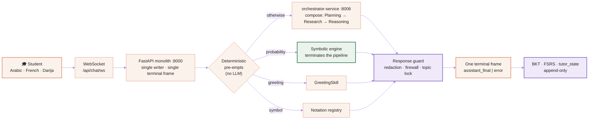

<div align="center">

<picture>
  <source media="(prefers-color-scheme: dark)" srcset="docs/assets/brand/hero-dark.svg">
  <source media="(prefers-color-scheme: light)" srcset="docs/assets/brand/hero-light.svg">
  
</picture>

<br/>

**A learning engine that measures what a student actually knows — and refuses to hand over the answer.**

Repository `NAAS-Agentic-Core` · engine **CogniForge** · product **ETAALIM.AI** · built for the Algerian Baccalauréat, engineered to the standard the US and EU markets audit for.

<br/>

[](#01--what-this-actually-is)
[](#05--the-cognitive-core)
[](#06--truth-discipline)
[](#07--every-law-names-its-enforcer)
<br/>
[](pyproject.toml)
[](app)
[](frontend)
[](.github/workflows/ci.yml)
[](LICENSE)

**English** · [العربية](README.ar.md)

</div>

---

> [!IMPORTANT]
> **The system is not a chat tutor. It is a Cognitive Lab — a thinking engine that models, tests and improves student reasoning.**
> Chat is a delivery surface. The core is: interactive object UI, cognitive modelling, error memory, adaptive generation, simulation.
> — [`CLAUDE.md`](CLAUDE.md) §0, the operational constitution every contributor and every agent inherits.

---

## Table of contents

| | | |
|---|---|---|
| [01 · What this actually is](#01--what-this-actually-is) | [07 · Every law names its enforcer](#07--every-law-names-its-enforcer) | [13 · CI contract](#13--the-ci-contract) |
| [02 · Why we withhold the answer](#02--why-we-withhold-the-answer-a-published-result-not-a-taste) | [08 · Nine orchestration layers](#08--nine-orchestration-layers) | [14 · Safeguarding & credibility](#14--safeguarding-data-protection-and-the-credibility-limit) |
| [03 · The four functions](#03--the-four-functions-and-the-deletion-test) | [09 · What is deliberately NOT built](#09--what-is-deliberately-not-built) | [15 · Documentation authority map](#15--documentation-authority-map) |
| [04 · Architecture](#04--architecture-at-a-glance) | [10 · Quick start](#10--quick-start) | [16 · Contributing](#16--contributing) |
| [05 · The cognitive core](#05--the-cognitive-core) | [11 · Repository map](#11--repository-map) | [17 · License, citation, contact](#17--license-citation-and-contact) |
| [06 · Truth discipline](#06--truth-discipline) | [12 · Roadmap](#12--roadmap) | |

---

## 01 · What this actually is

Eight hundred thousand Algerian students sit the Baccalauréat. Content is already free — Dzexams, ONEFD, YouTube. Explanation became free the day general-purpose language models shipped. **Neither is scarce, so neither is worth paying for.**

What does not exist, anywhere in this market, is a system that knows **what a specific student does not know**, ranks the remaining hours by what actually earns exam points, refuses to produce the step the student could still generate, and proves the return to the parent who pays.

That is what this repository builds.

> **الجملة الدستورية:** «الطالب لا يرسل سؤالاً إلى النظام؛ الطالب يدخل مسار تعلّم حيّ، والنظام مسؤول عن حفظ هذا المسار من الانهيار.»
> *A student does not send a question to the system. A student enters a live learning path, and the system is responsible for keeping that path from collapsing.* — [`.memory/pedagogical_os.md`](.memory/pedagogical_os.md) (D-153)

Three properties make it unusual, and all three are enforced by CI rather than promised in prose:

1. **Numbers are never generated.** Every probability, count and combinatorial value comes from a deterministic symbolic engine. The language model narrates understanding; it never decides truth.
2. **Answers are withheld by law.** The system will not reveal a result or a step the student can still produce. This is a published empirical result, not a stylistic preference — see [§02](#02--why-we-withhold-the-answer-a-published-result-not-a-taste).
3. **No capability is claimed without proof.** A component is ACTIVE only with `import` + `call chain` + `runtime evidence`. Everything else is labelled PARTIAL, DORMANT or ZOMBIE — publicly, in [`.memory/runtime_truth.md`](.memory/runtime_truth.md).

---

## 02 · Why we withhold the answer: a published result, not a taste

Bastani et al., *PNAS* (2025) — randomised field experiment, roughly a thousand secondary-school mathematics students:

<div align="center">

| Condition | While practising | On the unaided exam |
|:---|:---:|:---:|
| ChatGPT-style free access | **+48%** | **−17%** vs students who used nothing at all |
| Same model, pedagogical guardrails (hints, not answers) | **+127%** | harm eliminated |

</div>

The free-access group *felt* far better and performed *worse* when the tool was taken away. That gap between felt fluency and durable ability has a name here — the **illusion gap** — and shrinking it is the only success metric this project optimises for.

> **Banned optimisation targets, permanently:** session length, message count, momentary satisfaction. A system that maximises those maximises the illusion.

**Illusion gap = assisted performance − unaided, delayed capability.** It is emitted as `cogniforge_tutor_illusion_gap` and rendered on [Grafana dashboard 180](observability/grafana/dashboards/180-illusion-gap.json). When a measurement is not mature enough to be honest — too few unaided observations — it returns `null`, never a zero. A zero reads as *"we lost them"*; the truth was *"we do not know yet"*.

Full argument and citations: [`docs/VALUE_DOCTRINE.md`](docs/VALUE_DOCTRINE.md).

---

## 03 · The four functions, and the deletion test

<picture>
  <source media="(prefers-color-scheme: dark)" srcset="docs/assets/brand/four-functions-dark.svg">
  <source media="(prefers-color-scheme: light)" srcset="docs/assets/brand/four-functions-light.svg">
  
</picture>

Every proposed feature faces one question: *if this were deleted, which of the four stops working?* If the answer is "none, but it looks advanced" — it is deleted. Nine capabilities are explicitly forbidden by doctrine on exactly these grounds, including a content library, a from-scratch trained model, deep knowledge tracing before we have the data volume to justify it, gamified leaderboards, and any addictive-by-design mechanic. The users are minors under existential exam pressure; commitment devices are opt-in and revocable ([`SAFEGUARDING.md`](SAFEGUARDING.md)).

---

## 04 · Architecture at a glance



**Chat is WebSocket-only** — there is no `POST /api/chat/messages`; it returns 404 by design. The payload key is `question`, authentication rides `subprotocols=['jwt', TOKEN]`, and each turn emits **exactly one** terminal frame from a single emitter. The user message is written by the monolith at the WebSocket entry point; assistant persistence is coordinated by an explicit `persisted` flag so a dual write cannot happen ([`CLAUDE.md`](CLAUDE.md) §6.5).

### Two real topologies — documented as two, never as one

<table>
<tr><th align="left" width="50%">(a) Codespaces / uvicorn — what serves today</th><th align="left" width="50%">(b) Docker Compose — the migration destination</th></tr>
<tr valign="top"><td>

Launched by `.devcontainer/supervisor.sh`.

`frontend :5000` · `monolith :8000` · `user :8001`
`planning :8002` · `conversation :8003` · `orchestrator :8006`
`research :8007` · `reasoning :8008` · `content-retrieval :8009`
`foundations :8010` · `notation :8011`
`Prometheus :9090` · `Grafana :3001`

**Every student turn today goes through this path.**

</td><td>

`docker-compose.yml` describes the strangler-fig target: an API gateway, per-service Postgres, and the monolith **deliberately absent** (three CI gates prevent re-adding it).

Ports differ from (a) for five services. The gated source of truth is [`docs/architecture/PORTS_SOURCE_OF_TRUTH.json`](docs/architecture/PORTS_SOURCE_OF_TRUTH.json) and [`config/microservice_catalog.json`](config/microservice_catalog.json) — **13 microservices** declared.

**Building is not running.** Images are built and import-proven on every PR; no application container is booted in CI.

</td></tr>
</table>

### Service boundaries are contracts, not languages

Every service ships a committed OpenAPI contract, and a semantic parity gate compares declared endpoints against the live application — **API-first 15/15**, enforced by `check_openapi_parity` on every pull request. Cross-service imports are forbidden and checked by AST; shared logic is vendored with a parity gate rather than imported, so no service can reach into another's internals.

---

## 05 · The cognitive core

| Layer | What it is | Why it matters |
|---|---|---|
| **Symbolic probability engine** | [`app/services/skills/`](app/services/skills) — deterministic combinatorics, conditional probability, random variables | Zero LLM in the number path. A tutor that miscalculates once loses a student permanently |
| **Foundations** | [`app/core/foundations/`](app/core/foundations) — logic, number theory, linear algebra, calculus, statistics, optimisation, graph theory, formal languages, computability, complexity | Dependency-free stdlib. Every primitive raises on domain violation instead of returning a misleading `0` |
| **Reasoning core** | [`app/core/reasoning/`](app/core/reasoning) — argument trees with verified entailment, causal graphs (causation vs correlation), decomposition, abstraction, mental models | Validity is decided by the engine, never by the model. The model narrates |
| **BKT** | [`bkt_engine.py`](app/services/skills/bkt_engine.py) — Bayesian knowledge tracing, append-only interaction log | Mastery is a probability with a temporal record, not a score that gets overwritten |
| **FSRS-5 scheduling** | [`shared/scheduling/fsrs.py`](shared/scheduling/fsrs.py) | A correct answer produced with full scaffolding is graded `HARD`, not `GOOD`. `EASY` requires independence *and* durability — otherwise we would automate the illusion of fluency |
| **One curriculum** | [`shared/curriculum/registry.py`](shared/curriculum/registry.py) — **37 concepts**, maths + physics + natural sciences, with prerequisite edges | Three competing concept definitions once coexisted and no two agreed, so every physics question silently classified as `general`. One graph now, enforced |
| **Notation registry** | [`shared/notation/registry.py`](shared/notation/registry.py) | The system can define every symbol it prints — `C(n,k)`, `P_A(B)`, `Ω`, `X̄`. A symbol emitted without a registry entry turns CI red |
| **Illusion gap** | [`shared/illusion/`](shared/illusion) | Below the minimum observation count it returns `None`. A report that colours the whole curriculum after two sessions is a lying report |

**Skills, not prompt spaghetti.** Every AI capability is a Skill: one responsibility, a typed contract, Prometheus metrics, runnable tests, and independent fallback. **39 skills** are registered in [`app/services/skills/registry.py`](app/services/skills/registry.py); each inherits `BaseSkill`, and a skill with no live consumer is deleted rather than left as a stub.

---

## 06 · Truth discipline

<picture>
  <source media="(prefers-color-scheme: dark)" srcset="docs/assets/brand/proof-ladder-dark.svg">
  <source media="(prefers-color-scheme: light)" srcset="docs/assets/brand/proof-ladder-light.svg">
  
</picture>

The live status table is [`.memory/runtime_truth.md`](.memory/runtime_truth.md) — deliberately **not** reproduced here, because a status table copied into a second file drifts and then lies. A drift gate ([`scripts/runtime_truth.py`](scripts/runtime_truth.py) `--check`) compares the codebase against a committed lock file on every pull request.

Three consequences we live with:

- **A running process is not a healthy service.** Check the `/health` response, not the process list; a service that boots but fails graph warmup is `DEGRADED`, and `startup_state` says so.
- **A zero-valued dashboard panel is indistinguishable from a dead system.** Every metric must have a verified emitter in application source.
- **A stale lock file is a finding.** Lock files record when they were generated; a green gate on a stale lock is a false green.

---

## 07 · Every law names its enforcer

The founding observation of this codebase: **a house does not collapse from one bad decision — it collapses from the sum of small decisions that nothing was guarding.** So a law without an automatic enforcer is rejected twice: once for being unenforced, once for the silence that reads as discipline.

| Law | Enforcer | What turns CI red |
|---|---|---|
| No shell interpolation anywhere in subprocess execution | [`check_no_shell_true.py`](scripts/fitness/check_no_shell_true.py) | Any `shell=True`. Frozen debt is **empty** and only shrinks |
| Redaction policy is identical in both brains that enforce it | [`check_redaction_parity.py`](scripts/fitness/check_redaction_parity.py) | One path withholding the answer while the other leaks it |
| Intent markers have exactly one home | [`check_intent_single_source.py`](scripts/fitness/check_intent_single_source.py) | A second list of intent keywords anywhere in the tree |
| A model's capabilities are a dated claim with evidence | [`check_model_registry.py`](scripts/fitness/check_model_registry.py) | A banned model promoted, or a registry entry with no evidence |
| Every symbol the tutor prints is definable | [`check_notation_definable.py`](scripts/fitness/check_notation_definable.py) | A symbol emitted with no registry entry |
| One prerequisite graph, not two | [`check_prerequisite_single_graph.py`](scripts/fitness/check_prerequisite_single_graph.py) | A second traversal reading a different graph |
| Confusion is never congratulated | [`check_understanding_evidence.py`](scripts/fitness/check_understanding_evidence.py) | Treating a concept's *name* in a student question as evidence they understood it |
| A gate that cannot parse a file may not report it clean | [`check_gate_parse_honesty.py`](scripts/fitness/check_gate_parse_honesty.py) | `except SyntaxError: return []` — silent blindness inside an enforcer |
| Constitution equals reality; numbers are derived, never typed | [`check_constitution_reality.py`](scripts/fitness/check_constitution_reality.py) | Any hand-typed count in an authority doc that disagrees with its source — **including this README** |
| Authority maps resolve | [`check_authority_links.py`](scripts/fitness/check_authority_links.py) | A link in this README, `CLAUDE.md` or the documentation index pointing at a path that does not exist |
| Every CS domain declares status and file evidence | [`check_cs_knowledge_map.py`](scripts/fitness/check_cs_knowledge_map.py) | `ACTIVE` in front of a deleted file, or an empty gap cell |
| Design values come from tokens, with computed WCAG contrast | [`check_design_tokens.py`](scripts/fitness/check_design_tokens.py) | A raw colour in a component, or a contrast pair that fails AA when **calculated** |

Run the complete set locally — it reads `ci.yml`, so it cannot drift from CI:

```bash
make gates
```

> **Said out loud:** the deletion test in [§03](#03--the-four-functions-and-the-deletion-test) is enforced by **human judgement in review — no automated gate.** What *is* automated is the classification of every unit and its status. Declaring the absence of an enforcer is itself a rule here (an empty cell reads as discipline; a stated gap does not).

---

## 08 · Nine orchestration layers

The value of an AI system moved from *"write a better prompt"* to *"design the system that coordinates the agents"*. A prompt is contextual and disposable; an orchestration system produces a stable, testable, reusable output.

```
Knowledge → Skills → Agents → Orchestration → Memory → Evaluation → Governance → Infrastructure → Humans
```

Knowledge is what we know · Skills are how we execute · Agents are who executes · **Orchestration decides who does what, when, with which context, and who reviews before merge.** Law lives in [`docs/architecture/AGENTIC_ORCHESTRATION_DOCTRINE.md`](docs/architecture/AGENTIC_ORCHESTRATION_DOCTRINE.md); live status lives in [`.memory/agentic_runtime_doctrine.md`](.memory/agentic_runtime_doctrine.md). The separation is mandatory and gated: the law document fails CI if it grows a status column, and the status document fails if it cites evidence that does not exist.

**Humans are layer nine, not an exception.** Adopting a new technology requires an ADR. Raising any declared ratchet — a debt ceiling, a coverage floor — requires a written decision naming the reason, which makes loosening a gate expensive and visible instead of silent.

---

## 09 · What is deliberately NOT built

This section exists because a system that only advertises its strengths cannot be audited.

| Not built | Status | Why it is stated rather than hidden |
|---|---|---|
| **Payment gateway** | Seam, zero code | Entitlements and hashed vouchers exist; SATIM/Chargily integration is a documented seam. No half-integration pretending to take money |
| **LLM wired to the sandbox executor** | **Locked** | The sandbox runs real commands and the users are minors. Connecting any planner or model to tools is blocked until capability contracts, live probes, budgets, an append-only audit log and self-modification guards all land. A CI rule fails the build if one module imports both the executor and a model client |
| **Temporal worker** | Server proven, worker never connected | The server reports SERVING in CI; **no workflow has ever executed.** Booting is not running, and we refuse to round that up |
| **Vector retrieval** | DORMANT | Embeddings and rerankers exist in the tree with zero request-time calls. Ranked retrieval today is deterministic and lexical |
| **Monolith in the default compose file** | Absent by design | Strangler-fig phase 3. Three gates prevent re-adding it; its home is the legacy profile |
| **Deep knowledge tracing (DKT/SAKT)** | Forbidden for now | Data volume does not justify it. Knowing *why* the newest technique was rejected buys more credibility than deploying it |
| **Application containers in CI** | Not booted | Only the event stack (Redpanda, Temporal) is started live on each PR |

> **The credibility limit (D-227), applied to our own copy:** no claim of reading minds, of 100% accuracy, of zero errors, of changing humanity. An unfalsifiable statement is debt, not ambition — believed once, discovered later, and it takes everything true down with it. This platform serves minors and the parents who decide based on what we say.

---

## 10 · Quick start

### Developers and researchers

```bash
git clone https://github.com/HOUSSAM16ai/NAAS-Agentic-Core.git
cd NAAS-Agentic-Core

python3.12 -m venv .venv && source .venv/bin/activate
python -m pip install --upgrade pip
pip install -r requirements-dev.txt -r requirements-test.txt

# The gates that decide mergeability — same set, same order as CI
ruff check . && ruff format --check .
make gates                       # every fitness gate, read from ci.yml
pytest -v --cov=app --cov-report=term-missing --cov-fail-under=73
```

### Running the platform

```bash
# Codespaces / devcontainer: the supervisor launches backend, frontend and services
.devcontainer/supervisor.sh

# Or manually
python -m uvicorn app.main:app --host 0.0.0.0 --port 8000     # backend
cd frontend && npm run dev                                     # frontend on :5000

# Health — read the response, never the process list
curl -s http://localhost:8000/health | python -m json.tool
```

> [!NOTE]
> The application cannot start without `DATABASE_URL` (or `APP_DATABASE_URL`), and settings are read from the **process environment** at import time — exporting into the environment before launching uvicorn is required; writing `.env` alone is not enough. Use `postgresql+asyncpg://`, never bare `postgresql://`. Copy [`.env.example`](.env.example) to start.

### Full stack in Docker

```bash
docker compose -f docker-compose.yml up -d      # migration-destination topology
make microservices-health
```

---

## 11 · Repository map

```text
.
├── app/                    FastAPI monolith — routers, skills, core engines, kernel
│   ├── core/               foundations · reasoning · settings · database · prompts
│   ├── services/skills/    39 registered skills, each on BaseSkill
│   └── api/routers/        HTTP + WebSocket entrypoints (chat is WS-only)
├── shared/                 dependency-free engines: curriculum · scheduling · notation
│                           illusion · analytics · messaging · retrieval · ai_models
├── microservices/          service islands — each with its own contract and Dockerfile
├── frontend/               Next.js app · design tokens · theme contracts
├── scripts/fitness/        the enforcers — one gate per law
├── tests/                  contract · architecture · guardrail · transcript · security
├── docs/                   architecture doctrine · ADRs · contracts · governance
│   ├── architecture/       engineering doctrine · CS knowledge map · orchestration
│   └── contracts/openapi/  13 committed service contracts
├── observability/          Prometheus · Grafana dashboards · telemetry wiring
├── infra/                  Kubernetes · Terraform · ArgoCD
├── .memory/                institutional memory — runtime truth · decisions · issues
└── CLAUDE.md               the operational constitution (D-001 → D-293)
```

---

## 12 · Roadmap

The single live source is [`.memory/roadmap.md`](.memory/roadmap.md) — phases `M0 → M11` for the pedagogical engine, plus parallel tracks for the product, value and revenue layers, the cognitive execution engine, and the cognitive digital twin. Every planned unit carries a status from the proof ladder, a file-level evidence path, a written gap, and an explicit promotion condition.

Ambition is classified, never concealed: `PLANNED`, `SEAM` and `ABSENT` are tracked declarations. Unclassified ambition is the kind that gets forgotten.

Issue and decision history: [`.memory/decisions.md`](.memory/decisions.md) (D-001 → D-293) · [`.memory/issues.md`](.memory/issues.md) (ISS-001 → ISS-202). Both are append-only records, including the failures — a disaster with no written root cause is not closed.

---

## 13 · The CI contract

Branch protection on `main` should require exactly one check: **`required-ci`**. It aggregates **12 required jobs**, defined by the `needs` list in `.github/workflows/ci.yml`:

| Job | Enforces |
|---|---|
| `lint` | `ruff check` · `ruff format --check` · `mypy` (pinned versions — a linter that upgrades itself is a coin flip, not a gate) |
| `contracts` | Gateway/provider parity and contract tests |
| `guardrails` | Every fitness gate — run locally with `make gates` |
| `test-monolith` | Test suite with `--cov-fail-under=73` |
| `test-microservices` | Per-service suites plus OpenAPI parity |
| `frontend-tests` | Node suites · lockfile sync · generated TS types · typecheck · bundle budget |
| `skills-structural` | Skills registry and structure assertions |
| `event-stack-live` | Boots Redpanda and Temporal and proves delivery, idempotent skip and DLQ |
| `images-plan` + `images-build` | Every buildable image declared, built, and import-proven |

Non-aggregated workflows run alongside: `doc-integrity`, `runtime-truth`, `skills-doctrine-gate`, `skills-architecture-gate`, `structure-validation`, `frontend-theme-ci`, `observability-validation`.

Details: [`.memory/ci-gates.md`](.memory/ci-gates.md) · [`.github/BRANCH_PROTECTION_GUIDE.md`](.github/BRANCH_PROTECTION_GUIDE.md) · [`CONTRIBUTING.md`](CONTRIBUTING.md).

---

## 14 · Safeguarding, data protection, and the credibility limit

The users are minors preparing for an exam that shapes their adult lives. That fact is a design constraint, not a compliance footnote.

- **[`SAFEGUARDING.md`](SAFEGUARDING.md)** — youth safety, supervision, escalation. Commitment mechanics are chosen by the student and can be withdrawn by the student. No leaderboards, no addictive mechanics, no engagement-maximising design.
- **[`DATA_POLICY.md`](DATA_POLICY.md) · [`DATA_PROTECTION.md`](DATA_PROTECTION.md)** — privacy by design, retention, and handling.
- **Guardian visibility is structurally bounded.** A guardian sees direction, commitment and forecast. The guardian report **never queries message content** — enforced by a structural test that reads the source, not by a filter that could be misconfigured. One excerpt would turn the parent dashboard into a back door to the answer the student is not supposed to receive.
- **Linking is consent-first.** A guardian link starts `NULL`; no path attaches a minor's account without an action by the minor. An unlinked read returns 404, not 403 — a path identifier is not an authorisation.
- **[`SECURITY.md`](SECURITY.md) · [`GOVERNANCE.md`](GOVERNANCE.md) · [`CODE_OF_CONDUCT.md`](CODE_OF_CONDUCT.md)** — disclosure, decision rights, community standards.

**Scope boundaries.** This repository does not provide legal compliance advice for GDPR, the EU AI Act or local law — consult counsel. Guardrails reduce risk; they do not eliminate it. Adult supervision remains mandatory in youth-facing deployments.

---

## 15 · Documentation authority map

Two sources decide operational truth. Everything else is supporting reference or frozen archive.

| Level | Source | Role |
|---|---|---|
| 🏛️ Constitution | [`CLAUDE.md`](CLAUDE.md) | Permanent operational law (D-001 → D-293). Holds no dated narrative and no status tables |
| 🧠 Memory | [`.memory/`](.memory/README.md) | `runtime_truth` · `decisions` · `issues` · `roadmap` · `pedagogical_os` |
| 📐 Programme spec | [`spec.md`](spec.md) | The API-first simplification target — an aim, not current reality |
| 🎼 Doctrine | [`ENGINEERING_DOCTRINE.md`](docs/architecture/ENGINEERING_DOCTRINE.md) · [`CS_KNOWLEDGE_MAP.md`](docs/architecture/CS_KNOWLEDGE_MAP.md) · [`AGENTIC_ORCHESTRATION_DOCTRINE.md`](docs/architecture/AGENTIC_ORCHESTRATION_DOCTRINE.md) · [`COGNITIVE_EXECUTION_ENGINE.md`](docs/architecture/COGNITIVE_EXECUTION_ENGINE.md) · [`COGNITIVE_DIGITAL_TWIN.md`](docs/architecture/COGNITIVE_DIGITAL_TWIN.md) | Law documents; each names its gate |
| 💰 Value | [`VALUE_DOCTRINE.md`](docs/VALUE_DOCTRINE.md) · [`REVENUE_ENGINE_SPEC.md`](docs/REVENUE_ENGINE_SPEC.md) | Why anyone pays, and exactly what gets written |
| 🗺️ Index | [`docs/DOCUMENTATION_INDEX.md`](docs/DOCUMENTATION_INDEX.md) · [`docs/START_HERE.md`](docs/START_HERE.md) | Full map · newcomer entry point |
| 🔒 Contract | [`docs/DOCUMENTATION_CONTRACT.md`](docs/DOCUMENTATION_CONTRACT.md) · [`docs/DOCUMENTATION_MANIFEST.json`](docs/DOCUMENTATION_MANIFEST.json) | Live-documentation policy and machine-checked scope |
| 🤖 Agents | [`AGENTS.md`](AGENTS.md) | Rules any AI contributor inherits automatically |

On conflict, `CLAUDE.md` and `.memory/runtime_truth.md` win.

---

## 16 · Contributing

Read [`CONTRIBUTING.md`](CONTRIBUTING.md), [`docs/START_HERE.md`](docs/START_HERE.md), and [`docs/DOCUMENTATION_CONTRACT.md`](docs/DOCUMENTATION_CONTRACT.md) first. The short version:

1. **Check the truth table before you edit.** Is the component you are touching ACTIVE, PARTIAL, DORMANT or ZOMBIE? Editing dead code without wiring it into a live path is wasted work.
2. **New capability ⇒ new Skill.** Inherit `BaseSkill`, expose metrics, ship happy-path and error-path tests, work standalone. Skills never call each other directly — they compose through the orchestrator.
3. **New law ⇒ new gate.** If you cannot name the file that turns CI red when your rule is broken, the rule does not exist yet.
4. **`make gates` before you push.** It reads `ci.yml`, so what passes locally is what runs remotely.
5. **A disaster is not closed without a transcript contract** in `tests/transcripts/` that is **proven red before the fix**.

Any pull request that degrades this system into a standard text Q&A bot is rejected on sight, however well it is written.

---

## 17 · License, citation, and contact

Released under the [MIT License](LICENSE). If you use this work academically, cite it via [`CITATION.cff`](CITATION.cff).

**Registered entity:** Interactive Training Courses Platform (trading as NAAS AI Safety Lab) · **Jurisdiction:** Algeria (EMEA)
**Project lead:** Houssam Benmerah — h.benmerah@univ-eltarf.dz
**Upstream repository:** https://github.com/HOUSSAM16ai/NAAS-Agentic-Core

The lab publishes methods, findings and critical evaluations independently of any model provider or partner. References to third-party organisations or products imply no endorsement or affiliation.

<div align="center">
<br/>

**«الطالب لا يرسل سؤالاً إلى النظام؛ الطالب يدخل مسار تعلّم حيّ.»**

<sub>Built for 800,000 students who deserve a system that tells them the truth about what they know.</sub>

</div>
